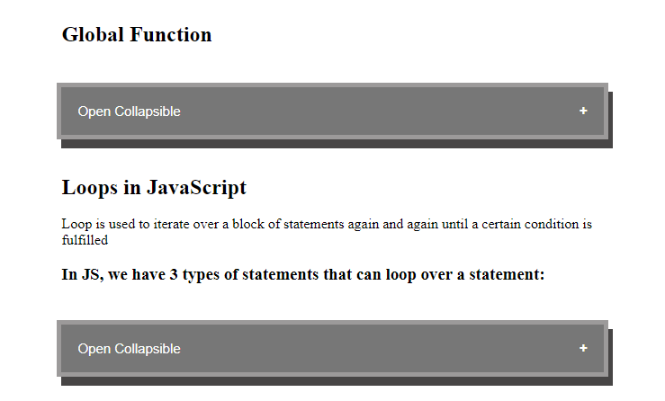
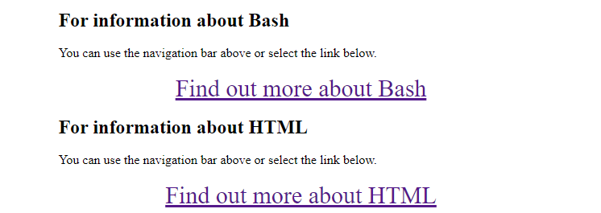
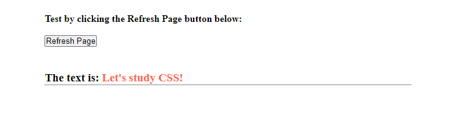

# Study Guide Webpage

## Description

A study guide and on going note pad for the full stack web developer bootcamp.

This Prework Study Guide was created for boot camp students who are going through the Prework. It contains notes on Bash, HTML, CSS, Git, and JavaScript.

## Table of Contents

- [Installation](#installation)
- [Usage](#usage)
- [Credits](#credits)
- [License](#license)
- [Badges](#badges)
- [Features](#features)
- [How To Contribute](#howtocontribute)
- [Tests](#tests)

## Installation

N/A

## Usage

To use this Prework Study Guide, you can review the notes in each section. For suggestions on what to study first, open the Chrome DevTools by pressing Command+Option+I (macOS) or Control+Shift+I (Windows). A console panel should open either below or to the side of the webpage in the browser. There you will see a list of topics we learned from the prework along with a suggestion on which topic to study first.

Use the dropdown bars to reveal more information:

Use the Nav bar to expore more pages:

Use the hyperlinks to navigate to other pages or references:

Use the buttons to see code work in action:

## Credits

Bash cheat sheet: Top 25 commands and creating custom commands
https://www.educative.io/blog/bash-shell-command-cheat-sheet

HTML Element Reference
https://www.w3schools.com/tags/default.asp

HTML Character Codes
https://html.com/character-codes/

CSS Reference
https://www.w3schools.com/cssref/index.php

Git Cheat Sheet
https://about.gitlab.com/images/press/git-cheat-sheet.pdf

JavaScript Cheat Sheet for Quick Guide in 2023
https://www.techgeekbuzz.com/blog/javascript-cheat-sheet/

## License

Please refer to the LICENSE in the repo.

## Badges 🏆

## Features

N/A

## How to Contribute

N/A

## Tests

N/A